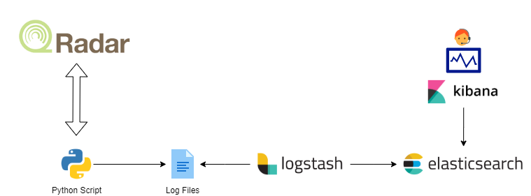

# ELK4QRADAR
This project is made to help SOC MSSP teams that use QRadar with multiple clients to collecte and centralize monitoring statistics from all QRadar deployments. 

### Steps
1. `PUT _template/<YOUR_TEMPLATE_NAME>`. In this repository we provide an index template that you can in your Elastic Stack
2. Populate the YAML files in /etc/logstash with the appropriate data to your context. We Provide samples in this project: 
    - [timezone.yml](./logstash/timezone.yml): Contains dictionary of client name and their correspondant timezones.
    - [clientnames.yml](./logstash/clientnames.yml) : Contains a dictionary of input configuration tags and their correspondant client names
3. Copy conf.d configuration in your Logstash conf.d folder and customize to your needs.
    - [input sample](./logstash/conf.d/0001-input-sample.conf)
    - [filter sample](./logstash/conf.d/0020-filter.conf)
    - [output sample](./logstash/conf.d/0030-output.conf)
4. Create a `/home/USER/Offenses/` folder to save the extracted search data from QRadar in CSV.

### Tasks
- [ ] Adding more AQL queries and searches
- [ ] Automating the collectiong process